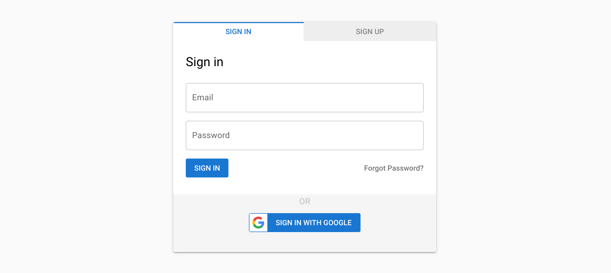

# Quasar2 / Vue3 / Firebase Authentication (web9)

This project is a minimal working quasar project that has all the needed pages and functionality to handle signup, login, forgot-password and verify email, with Google or email/password.
Everything else is mostly left untouched as Quasar vanilla project.



## Getting started
This project was tested with node v14.17.4
To get started:
1. Fork the repo
2. Install all dependencies
    ```bash
    npm install
    ```
3. Create Firebase projct - see next section
4. Start the app
    ```bash
    npm run serve
    ```
## Creating Firebase project
1. Go to [Firebase Console](https://console.firebase.google.com/)
2. Click _Add Project_ Give it a name and click _Continue_.
3. Disable Google Analytics click _Continue_.
4. After the project was created click _Continue_. It will take you to the project overview. Now we need to create an app.
5. Click the _web_ icon, give your app a name and click _Register App_.
6. You’ll be taken to _Step 2 - Add Firebase SDK_.
7. Copy `firebaseConfig` json that looks like this:
   ```javascript
   const firebaseConfig = {
     apiKey: "xxxxxxxxxxx",
     authDomain: "xxxxxxxxxx",
     projectId: "xxxxxxxxxx",
     storageBucket: "xxxxxxxx",
     messagingSenderId: "xxxxxxxxx",
     appId: "xxxxxxx"
   };
   ```
8. Go to `src/boot/firebase.js` and replace the existing config with your own
9. Back in Firebase Console, click _Continue to Console_.
10. On the left panel click _Authentication_, then click _Sign-in method_.
11. Enable _Email/Password_. Do not enable _Email link_.
12. Before enabling Google, let's verify our domain so Google can send emails on our behalf. Click the _Templates_ tab.
13. On one of the email templates, click the pencil icon next to the _From_ address.
14. Click _Customise domain_ link under the domain name.
15. Follow the instructions on configuring your DNS and complete the verification.
16. Once done, we can go back to adding Google as login method. Click _Sign-in method_ tab again.
17. Enable _Google_. You'll have to provide your app's support-email. Also make sure that your _Project public facing name_ appears as you want your customers to see it. It will appear on Google's authentication dialog.

## Server authentication

To authenticate user on your server, get idToken and send it as `Authorization` header. I usually prefix it with the string `IDTOKEN.` so on the server I know what type of token was sent and how I should verify it. Of course you don't have to do that, and if you only expect this type of token you can skip the prefix. Here's client side example:
```javascript
import { getIdToken } from '../services/auth'
// ...
const idToken = await getIdToken();
const res = await fetch (url, {
  method,
  headers: {
      'Authorization': `IDTOKEN.${idToken}`
  },
  body
})
```

### Validating on the Server
Depending on your environment, here's an example how to verify the token manually. You can also use Firestore SDK as explained [here](https://firebase.google.com/docs/auth/admin/verify-id-tokens#verify_id_tokens_using_the_firebase_admin_sdk)
The returned parsed idToken will have `uid` property which you can use as unique identifier in your server code.

```javascript
import jwt from 'jsonwebtoken';

const auth = request.headers.authorization;
if (auth && auth.startsWith('IDTOKEN.')) {
  const idToken = await validateIdToken(auth.substr('IDTOKEN.'.length));
  if (idToken.uid) {
      // verification succeeded. Use uid as unique identifier for that user
  }
}

export async function validateIdToken (idToken) {
  async function getKey(header){
    const res = await fetch('https://www.googleapis.com/robot/v1/metadata/x509/securetoken@system.gserviceaccount.com')
    const keys = await res.json();
    return keys[header.kid];
  }
  const tokenHeader = jwt.decode(idToken, {complete: true}).header;
  // check that tokenHeader.iss === 'https://securetoken.google.com/<projectId>'
  // check that tokenHeader.aud === '<projectId>'
  let key = await getKey(tokenHeader);
  key = key.trim();
  try {
    return jwt.verify(idToken, key);
  } catch (err) {
    console.log("ERROR!", err);
    return {};
  }
}
```

## Contribution

Contributions are welcome. Just create a PR and explain what you've done :)

## Todo (in no particular order)
1. Email verification
2. Change password flow - make "choose new password" part of this webapp. Currently it's under myapp.firebaseio subdomain.
3. Passwordless login (email link)
4. ~~Send token to server for authorization~~
5. Anonymous signin - allow users to try before signing up, and then continue with their work after signup - https://firebase.google.com/docs/auth/web/anonymous-auth


